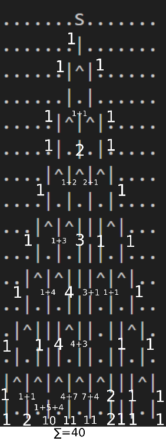

# PRISTOP K REŠEVANJU NALOG AoC25

## Day 01

Preberemo po vrstici, če gre v desno prištevamo če gre v levo pa odštevamo. ko prištejemo (v desno), števcu naloge 2 prištejemo poz / 100 (tolikorat smo šli čez).

Pri premiku v levo števcu prištejemo (100 - poz + rot) / 100. Ker je pri prehodu  čez nič veliko edge casov raje prezrcalimo čez 50 (100 - poz) in prištevamo rotacijo, dobljeno številko delimo 100 da dobimo kolikorat smo šli čez 0. Pri tem načinu je še vedno problem, če smo na 0 in gremo v negativno še enkrat prišteje, da smo šli čez. Da to rešimo, odštejemo eno če smo na 0.

Doblejno pozicijo mapiramo na območje 0-100 z enačbo poz = (100 + poz % 100) % 100 

Če smo na 0 prištejemo števcu 1.

## Day 02

 ### Naloga 1

 Za prvo možnost vzamemo prvo polovico začetka območja (če je to mogoče) in prištevamo po ena. Te polovice združimo in pogledamo če je v območju. 

 ### Naloga 2

 Proviramo vse dolžine ponavljanja (teh je: start/2) in proviramo če so na danem bmočju (med start in end), zapišemo jih v unordered set, ker želimo neponavljajoče, nakoncu jih seštejemo.

 Ker pa napisana funkcija deluje le če sta začetek in konec enako dolga v main razdelimo neveljavna območja na dva dela npr 67-115 -> 67-99 in 100 ->115.

 ## Day 03 

 ### Naloga 1

Najdemo maksimalno vrednost od začetka do predzadnjega, zatem najdemo še od prejšnje najdene do konca. Števke združimo spremenimo v int in prištevamo končnemu rezultatu.

### Naloga 2

Podobno kot pri prvi le da začnemo iskanje do 11 predzadnje števke in potem od najdene do 10 predzadnje itd. do konca.
 
 ## Day 04

Začnemo z zapisom "skladišča" v vektor stringov (vrstic). Dodamo tudi "padding, (pike)" okoli celotnega skladišča da poenostavi zapis preverjanja.

### Naloga 1

Z for loop gremo čez vse pozicije v skladišču (izključujoče padding), če pristanemo na rolici papirja preštejemo koliko rolic je okoli, če je manj od 4 jo dodamo številu ki ga iščemo.

### Naloga 2

Naredimo isto le da če jo lahko dostopa jo odstranimo ('@'->'.'). Ponavljamo dokler se število pobranih ne spreminja več.

## Day 05

Začeno z zapisom vseh danih območij v vektor parov, jih uredimo po velikosti začetne vrednosti območij. Nato naredimo nov vektor parov območij ki se ne prekrivajo (merged). To storimo z naslednjim algoritmom: Prvo območje prepišemo, če se naslednje območje prekriva ampak ne celo (začetek naslednjega < konec merged) zapišemo nov konec. Če se ne prekrivajo ga dodamo kot novo območje.

### Naloga 1

Če je podan id v katerem od (merged) območij prištejemo števec.

### Naloga 2

Vsi Id ki so še sveži je seštevek velikosti (merged)območij.

## Day 06

Začeno z zapisom vseh številk v vektor. Naredimo poseben vektor za zapis operatorjev.

### Naloga 1

V for zanki gremo čez vektor in seštevamo če je operator +, če je * množimo v poseben "zmnoževalnik" (v programu multiplication), ki ga nato prištejemo seštevalniku.

## Naloga 2

Številke "transponiramo" , hkrati tudi ne zapisujemo presledkov, dobimo nov vektor v katerem naredimo podobno kot pri prvem.

## Day 07

Uporabimo map (za drugo nalogo, za prvo bi lahko samo vector ali array), key je lokacija žarka (indeks v vrstici ki jo beremo) in vrednost je število možnosti da pridemo v ta žarek (za drugo nalogo) 

Najprej najdemo kje je 'S' in tam zapišemo 1. Vsako drugo vrsto preskočimo ker so same pike. Če v prebrani vrsti najdemo spliter, ki ima nad sabo žarek, ga splitamo na naslednji način:

- Na točki levo in desno prištejemo vrednost v dani točki (število možnosti za priti v dani žarek), če žarka na sosednjih točkah ni se samo prepiše vrednost na dva nova žarka, če žarek že obstaja je skupnih možnosti za priti v tisti žarek seštevek dosedanjih možnosti. (Boljše obrazloženo na skici).
- Točko v kateri smo izbrišemo (ker se je splitala) in povečamo števec 1 za 1.

### Naloga 2

Da dobimo vse možnosti do vseh končnih žarkov moramo vse možnosti do posameznih žarkov sešteti.

